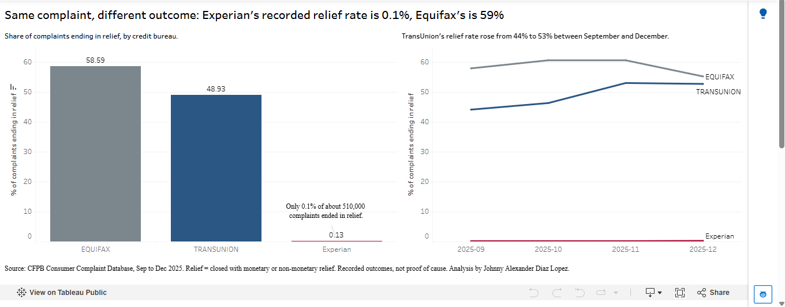

# Same Complaint, Different Outcome: CFPB Consumer Complaints (Sep–Dec 2025)

**Live dashboard:** [View on Tableau Public](https://public.tableau.com/views/CFPBComplaints-SameComplaintDifferentOutcome_/Dashboard1)

   

## Business question
Which products and companies are most likely to see consumer complaints end in relief, and what explains the differences?

## Key findings
1. **Credit reporting is 90% of complaints** (1.83M of 2.03M) and ends in relief 37.6% of the time, versus about 20% for all other products combined.
2. **The company, not the issue type, drives the outcome.** The three main credit reporting issues have near-identical relief rates (37–38%), but recorded outcomes differ sharply by bureau: **Equifax 58.6%, TransUnion 48.9%, Experian 0.1%**.
3. **The gap holds within every issue type**, so a different complaint mix doesn't explain it. Experian's rate is 0.1% in each category.
4. **Experian's pattern is extremely consistent:** 99.8–99.9% of its roughly 510,000 complaints were closed with an explanation in every month.
5. **TransUnion's relief rate rose from 44.1% (Sep) to 52.7% (Dec)**, while Equifax stayed between 55% and 61%.

## Important caveat
These are *recorded outcomes*, not proof of how consumers were treated. Possible explanations include differences in response policy, in how outcomes are categorized or reported to the CFPB, or in unobserved complaint characteristics. CFPB complaints are unverified and not a representative sample of all consumers.

## Data
- Source: CFPB Consumer Complaint Database (public domain), bimonthly exports for Sep–Oct and Nov–Dec 2025.
- 2,032,768 complaints loaded; 285 with status "In progress" excluded, leaving 2,032,483.
- Raw files are not included because of size. Download them from the CFPB website.

## Method
1. Loaded and combined the CSV exports with Python (pandas) into SQLite (`01_load_data.ipynb`, `load_data.py`).
2. Profiled missing values, duplicates, and response fields.
3. Defined **relief** = "Closed with monetary relief" or "Closed with non-monetary relief".
4. Analyzed relief rates by product, issue, company and month with SQL.
5. Built summary tables (`summary_*.csv`) and a Tableau Public dashboard.

## Data-quality notes
- 97.9% of `Tags` and 85.6% of narratives are blank, which is expected (optional fields).
- The "Untimely response" outcome (4,505) doesn't match "Timely response? = No" (7,790), so timeliness was not used as an outcome.
- Some issue labels are near-duplicates (e.g., "investigation into an existing problem" vs "existing issue").
- About 194 of the 285 "In progress" complaints were student loans, so that product's relief rate may be slightly understated.

## Limitations and next steps
- Only Sep–Dec 2025 is covered. Adding earlier months would show whether the patterns persist.
- Analyze complaint narratives to see whether text differs by bureau.
- Compare against company size to put volumes in context.

## Tools
Python (pandas), SQL (SQLite), Tableau Public, VS Code

**Author:** Johnny Alexander Diaz Lopez
